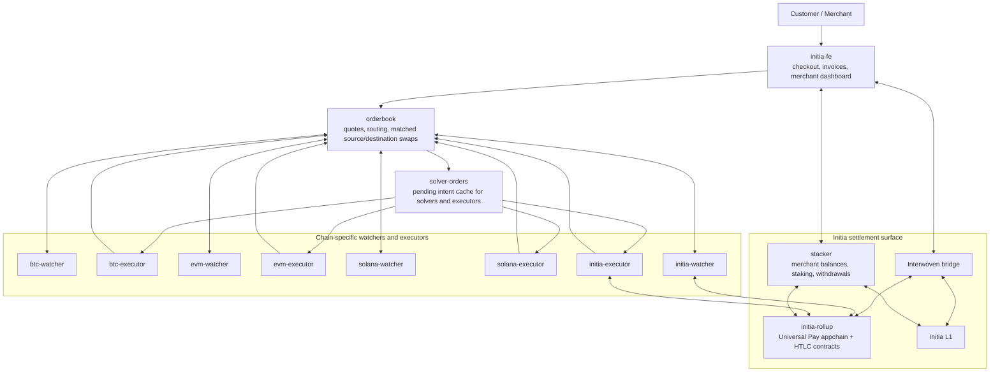
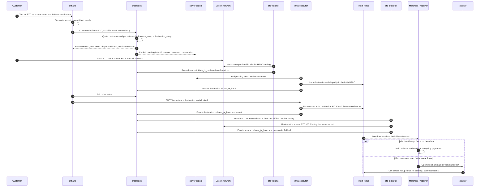

# uniPay

Consolidated monorepo for the uniPay stack: frontend, Initia rollup tooling, merchant automation, quoting, and chain-specific watcher/executor services.

## Initia Hackathon Submission

- **Project Name**: uniPay

### Project Overview

uniPay is a universal checkout and settlement system built around an Initia rollup. Customers can pay from multiple source ecosystems, while merchants settle into an Initia-native flow with a dedicated frontend, rollup bridge tooling, and backend services for routing, execution, and merchant yield operations.

The repo combines the full service stack in one place so the rollup, frontend, order routing, and chain adapters can be reviewed together. The local demo centers on the Initia rollup flow in `initia-rollup` and the hackathon frontend in `initia-fe`.

### Implementation Detail

- **The Custom Implementation**: uniPay is not a single dApp scaffold. It combines a dedicated Initia EVM rollup launcher, bridge seeding and HTLC deployment scripts, a customer/merchant frontend, merchant earning flows in `stacker`, quote and order routing in `orderbook` and `solver-orders`, and per-chain watcher/executor services for Bitcoin, EVM, Solana, and Initia settlement paths.
- **The Native Feature**: `interwoven-bridge`. The frontend uses `InterwovenKit` for wallet connection and Initia transaction flows, and the merchant experience is wired to Initia bridge actions so users can move value between the rollup and Initia L1 with the expected Initia UX.

### How to Run Locally

1. Install dependencies for the demo surfaces you need: `cd initia-rollup && npm install`, `cd ../initia-fe && npm install`. If you want the merchant API and earning flows live too, also run `cd ../stacker && pnpm install`.
2. Copy `initia-rollup/.env.example` to `initia-rollup/.env`, then fill the small required set: `MERCHANT_PRIVATE_KEY`, `MERCHANT_INIT_ADDRESS`, `MERCHANT_HEX_ADDRESS`, and `TARGET_POOL_ID`. After that, run `cd initia-rollup && npm run preflight`.
3. From `initia-rollup`, run `npm run launch`, `npm run seed-bridge`, and `npm run redeploy-htlc`. These scripts launch the local Initia rollup, seed bridged USDC, deploy the HTLC contract, and write the needed `VITE_*` values into `initia-fe/.env.local`.
4. Start the frontend with `cd initia-fe && npm run dev`, then open the printed Vite URL in a browser. If you want the merchant earn flows instead of frontend-only UI work, start the supporting backend services as well, especially `stacker`, and point `VITE_STACKER_API_URL` at the running API.

## System Flow

The system is split into three layers:

- `initia-fe` handles checkout, merchant UX, wallet connection, and Interwoven bridge flows.
- `orderbook` is the source of truth for quotes, matched orders, and source/destination swap state.
- Watchers observe chain state, while executors act on chain state to lock, redeem, refund, and finalize cross-chain HTLC legs.

### 1. Platform Architecture

### 2. Example Trade: Bitcoin -> Initia

### Repository Layout

| Path | Purpose |
| --- | --- |
| `initia-fe` | Hackathon frontend with customer and merchant flows, `InterwovenKit`, and Initia wallet/bridge integration |
| `initia-rollup` | Local Initia rollup launcher, bridge seeding, HTLC deployment, and demo orchestration scripts |
| `stacker` | Merchant automation backend for positions, rewards, withdrawals, and keeper jobs |
| `orderbook` | Quote, policy, pricing, and routing logic |
| `solver-orders` | Solver-facing order service |
| `btc-watcher` / `btc-executor` | Bitcoin source-chain detection and execution |
| `evm-watcher` / `evm-executor` | EVM source-chain detection and execution |
| `solana-watcher` / `solana-executor` | Solana source-chain detection and execution |
| `initia-watcher` / `initia-executor` | Initia-side monitoring and execution |

### Notes For Reviewers

- This repository is the single consolidated repo for the latest committed `HEAD` of every service that currently powers uniPay.
- The Initia-specific demo path starts in `initia-rollup` and `initia-fe`; the other services remain in-repo so the full architecture and chain adapters can be reviewed together.
